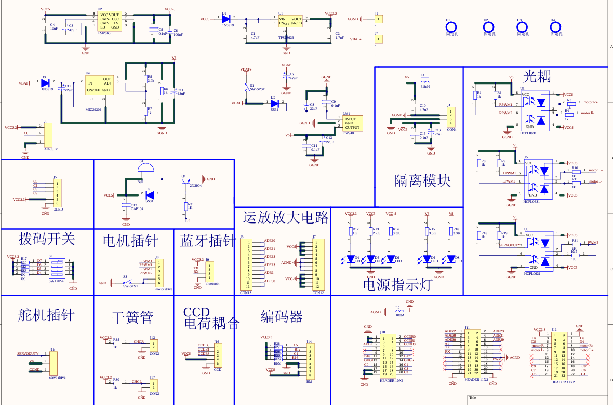

# 智能车主控板

> 该篇博客写于2024年暑期个人学习PCB AD24期间，主要参考 B站凡亿教育 [AD23|AD22四层板智能车PCB设计](https://www.bilibili.com/video/BV16t411N7RD?p=37&vd_source=ff9a60fb4cd8133ac45d108a89246dc0)

## 模块的理解与学习

{width=100%}

### 原理图 