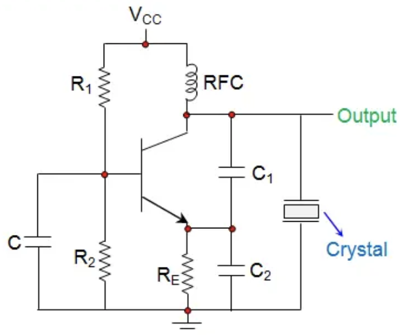

# 孙靖宇的随笔 | 04/2025

## 23.04.2025 

最近开始回归到听播客的状态，以及对于经济学激起极大的兴趣。

## 09.06.2025 周一

主要针对于振荡电路的输出电压产生了困惑，之前认为毕设设计的pierce oscillator电路的输出电压不可能大于BJT的供电电压，但是LTspice仿真结果以及AWR仿真结果都显示出了一致性，即共射级电路的输出电压大于供电电压2.5V。后经过查资料得知， 所设计的电路结构如下图所示，BJT的集电极端连接了一个电感（RFC）作为 __射频阻流线圈（在高频下隔绝交流信号与电源，可以防止电源受到高频信号的干扰，为晶体管提供偏置直流电，低频下阻抗很小__。
{width=50%}
  *图 1：晶体振荡器原理图*

## 11.06.2025 Wednesday

1. 完善中英文简历  ☑ *(完善并发布到小红书希望能够增加简历曝光度)*
2. 完善LinkedIn   *（没有完善经历，LinkedIn上投递的话也是跳转第三方，看一看吧再）*

Optional （没有时间，明天做吧）

- 将子博的任务干完

## 12.06.2025 Thursday

1. 绘制以及编写子博的任务            ☑
2. 编写毕设的log book 完成至跟上进度 ☑

## 13.06.2025 Friday

1. 学习电子工程师基础知识并整理笔记。4h
2. 毕设跟着手册进行设计 3h