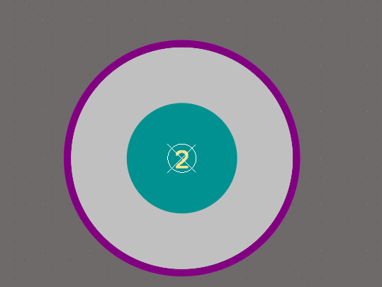
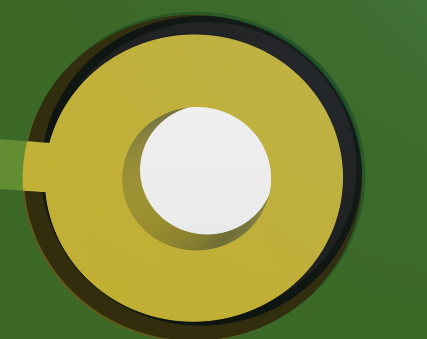
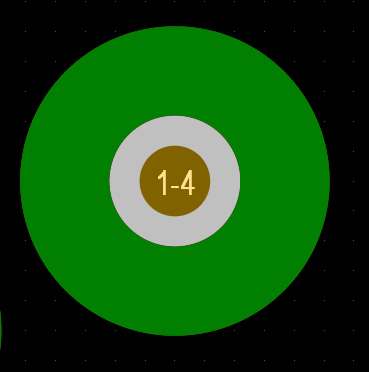
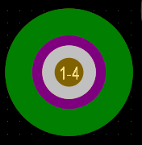

# PCB设计 AD24

> 该笔记是在学习AD24软件过程中遇到的一些列问题的记录，并且不断更新有关PCB绘制应注意的事项。

## 过孔，焊盘的区别 

* 过孔```via```: 用于连接不同层的导线，一般Top layer 以及 bottom layer 会覆盖 **绿油** ```Tended``` 

* 焊盘```pad```: 固定元器件的引脚 (兼有过孔的功能)

过孔是不需要覆盖阻焊的 (**覆盖阻焊层之后会漏出铜皮**)。

### 焊盘和过孔的2D，3D视图

#### 2D 焊盘

{width="30%"}

* 阻焊: 紫色部分 （阻焊是用来防止绿油的覆盖）
* 焊盘: 白色部分  
* 过孔: 蓝色部分   

#### 3D 焊盘

{width="30%"}  

* 阻焊: 黑色部分 （阻焊是用来防止绿油的覆盖）
* 焊盘: 黄色部分  
* 过孔: 白色部分   

#### 2D 过孔 ```分为Tented 和 没有 Tented```

下图左边是没有阻焊的过孔```Tented```，右边是有阻焊的过孔``` without Tented```

{width="30%"} {width="30%"} 


#### 3D 过孔  

左边视图是Top and Bottom 勾选Tended 的3D视图，右边是没有勾选的

{width="30%"}  {width="30%"} 

