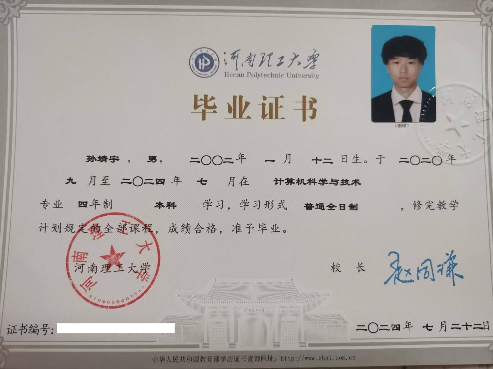
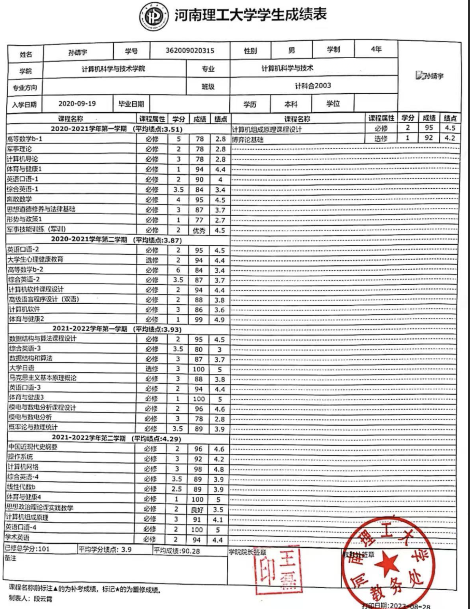
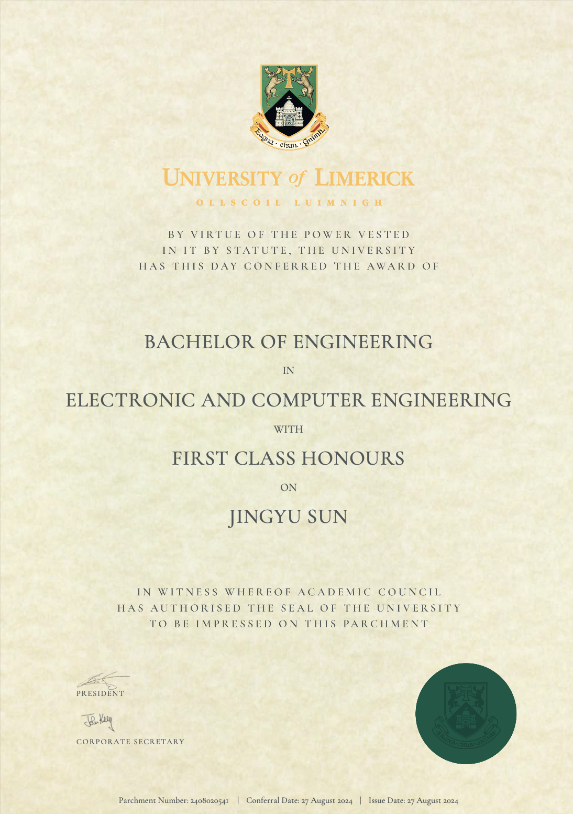
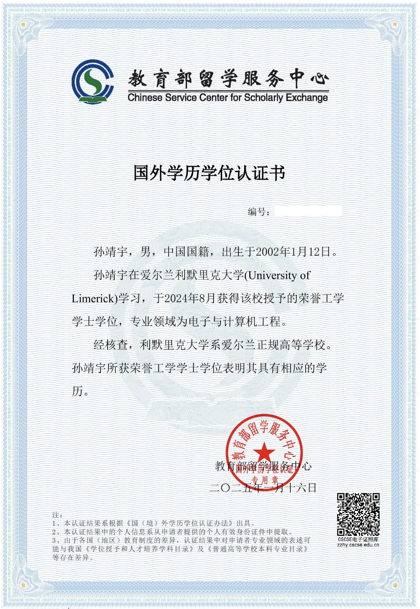
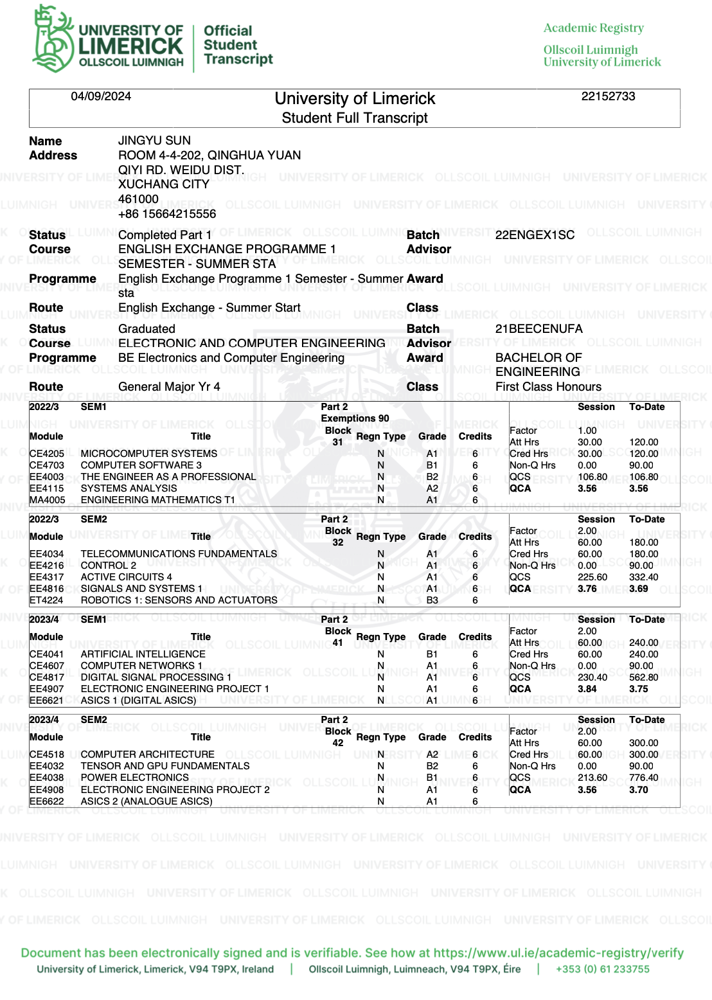
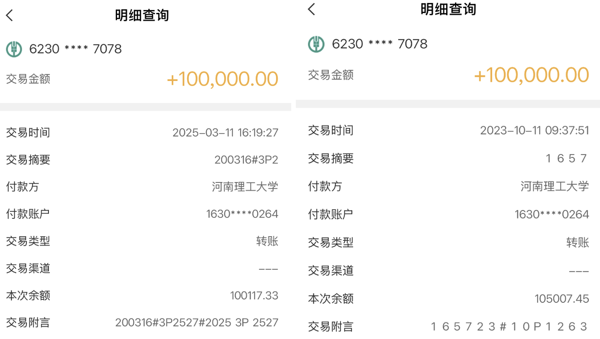
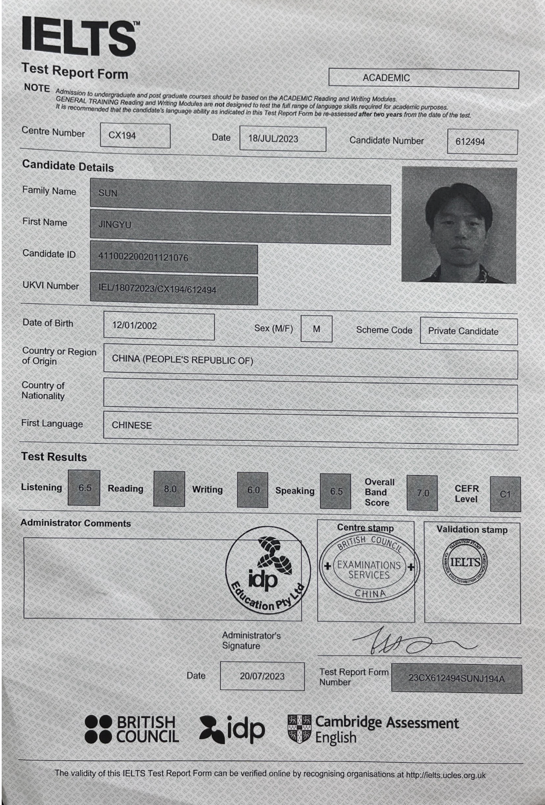

# 证书及奖项

## 河南理工大学

### 毕业证以及学位证

{width=80%}

{width=70%}

### 成绩单

{width=70%}

### 奖项

 

{width=80%}

{width=80%}

## University of Limerick 

### 利默里克大学毕业证以及学位证

{width=70%}

{width=70%}

### 成绩单
{width=70%}

### 奖项

2022 - 2024 两年留学生奖学金每年10万人名币
{width=70%}

## IELTS Certificate

英语雅思7.0 (2023年7月份)

{width=70%}