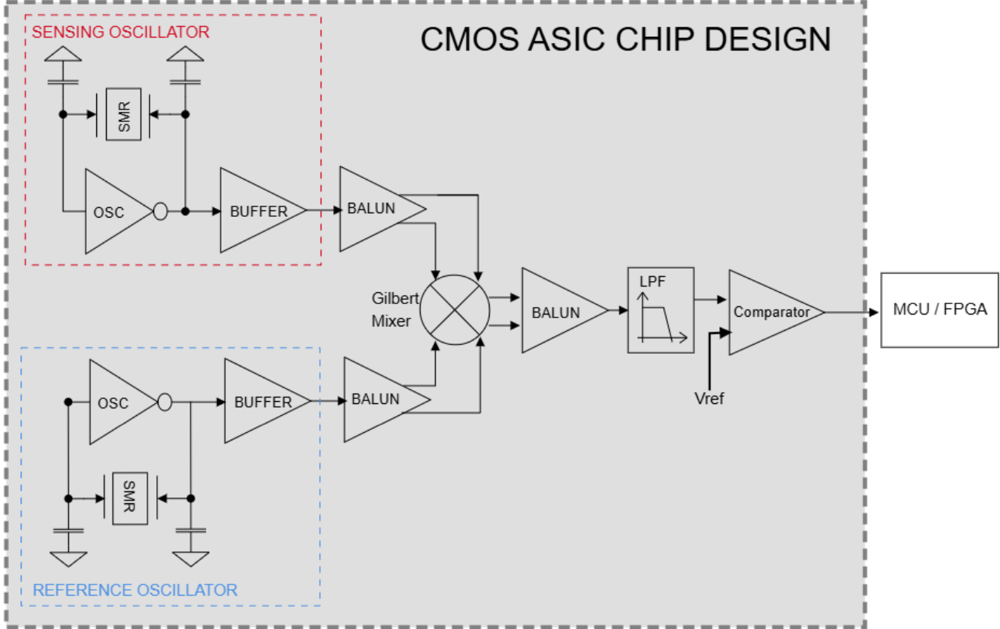
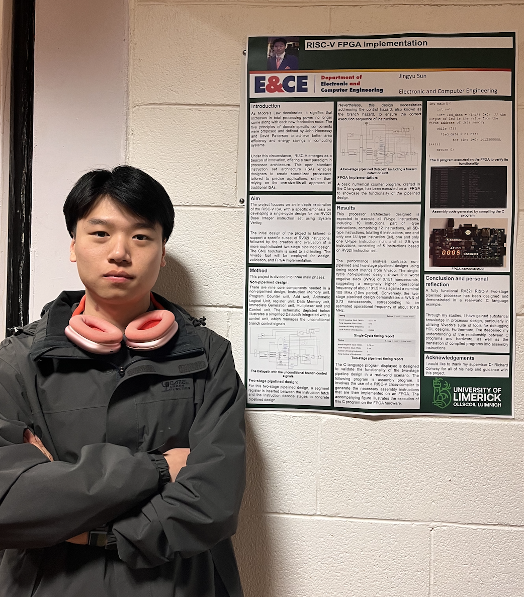
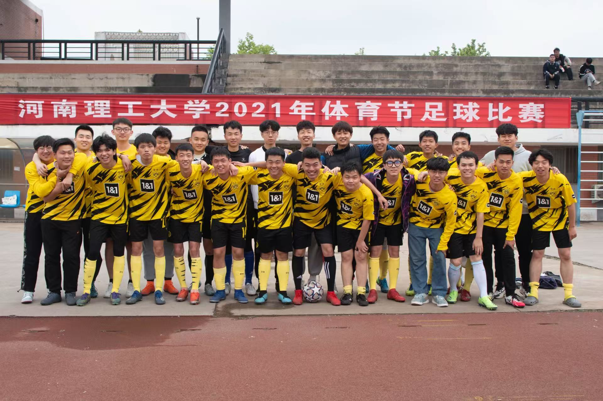
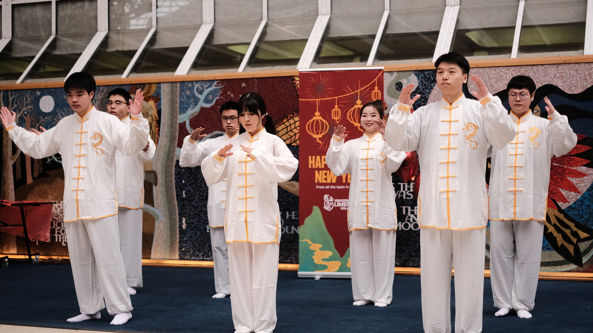
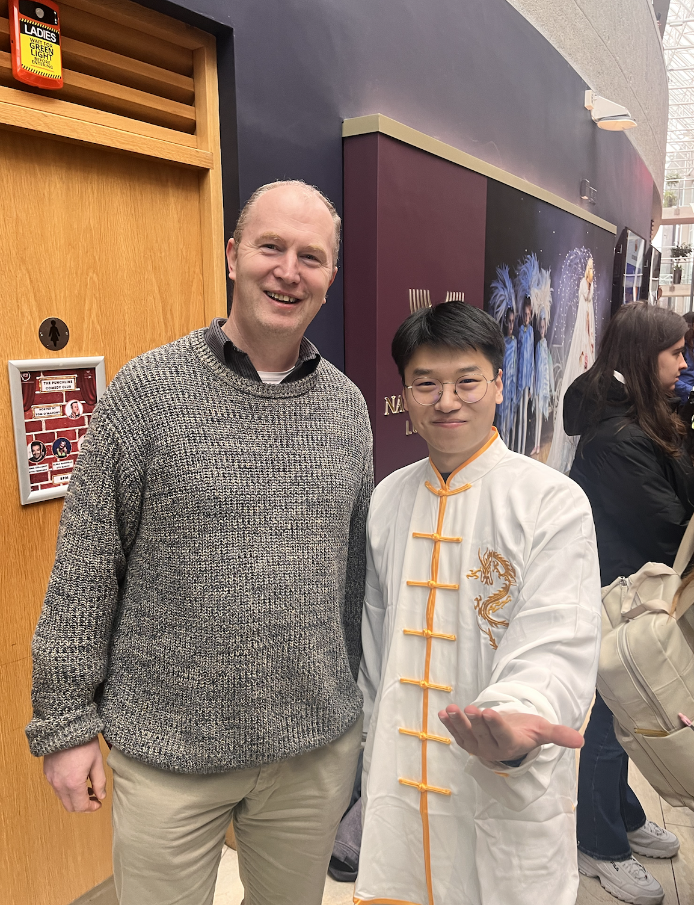
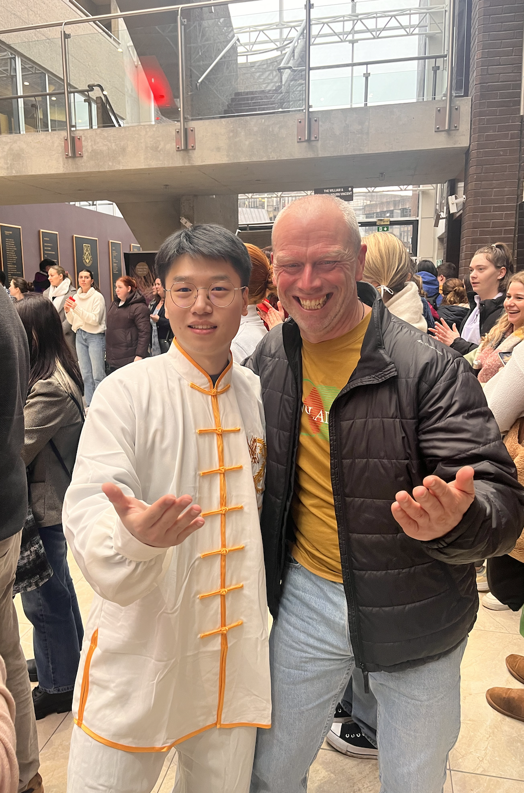
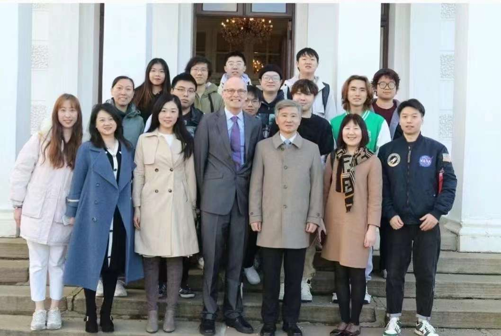
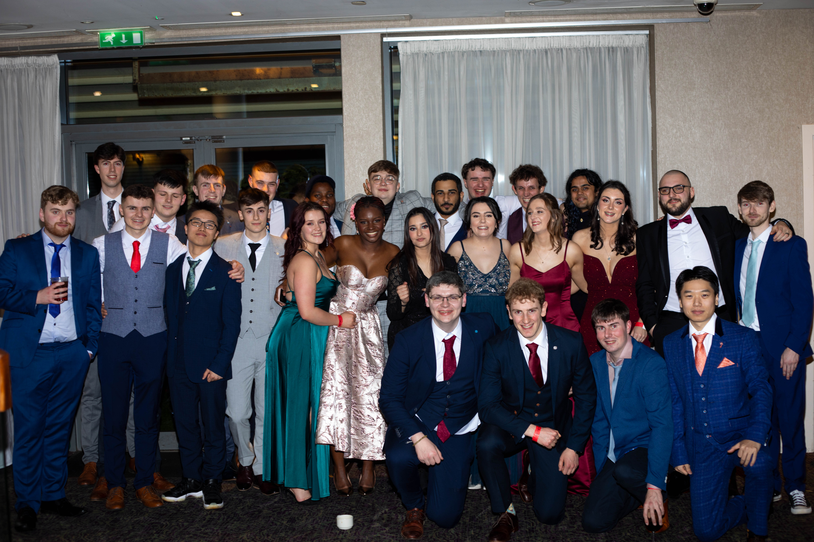

# 个人经历

---

## 🎓 教育经历

**英国华威大学**（硕士研究生，QS排名 67）  
*电气与电子工程* ｜ 2024.09 – 2025.12  
主修课程：高性能嵌入式系统设计、集成电路与智能设备、射频与微波电路、现代控制理论  
毕业设计: [固装谐振传感器(MEMs)射频IC设计](#Warwick_FYP)  
GPA：Distinction 70.3/100

**爱尔兰利默里克大学**（本科，爱尔兰国立藤校）  
*电子与计算机工程* ｜ 2022.09 – 2024.05  
主修课程：通信原理、信号与系统、数模集成电路、数字信号处理、人工智能、电力电子  
毕业设计: [RISC-V 两级流水 CPU FPGA 实现](#UL_FYP)  
GPA：3.7 / 4.0
连续两年获得留学生奖学金，[一等一荣誉学位毕业](../ME/certificate.md#university-of-limerick)

**河南理工大学**  
*计算机科学与技术* ｜ 2020.09 – 2022.06  
核心课程：数据结构与算法、计算机网络、操作系统、计算机组成原理、数字电路  
GPA：3.89 / 5.0  
系内排名: 1/128 (Top 1%)  
连续两年专业第一，获得过[国家奖学金](../ME/certificate.md#National_certification)，可保研至 985 西北工业大学。

---

## 💼 实习经历

[**华勤技术股份有限公司（上海）**](https://en.huaqin.com/)（ODM厂商）  
*海外平板业务安全模块支持（Android / BSP 驱动开发）* ｜ 2025.08 – 至今  

- 客户支持：面向海外客户平板项目提供安全模块技术支持，参与 Android 驱动适配与优化，确保功能在不同硬件平台上稳定实现。  
- 需求沟通：与海外客户进行需求澄清与技术沟通，完成安全驱动移植、调试。  
- 问题解决：通过串口调试与内核日志分析，快速定位并解决系统适配问题，提升项目交付效率与客户满意度。  
- 团队协作：积累了与研发、测试、SPM 团队的跨部门协作经验，提升了 C 语言驱动开发与内核调试能力。
- 开发工具: Jenkins、JIRA、Repo、Gerrit、Git。  

**华威大学微传感器与生物电子实验室（英国考文垂）**  
*谐振传感器（MEMS）射频 IC 设计* ｜ 2025.01 – 2025.08  

- 参与基于 SMR 谐振器的 VOCs 气体传感器平台开发，负责射频电路与 ASIC 数模模块的设计与实现。  
- 设计并仿真振荡器、混频器、低通滤波器及比较器模块，解决振荡频率偏离 SMR 谐振频率的问题。  
- 使用 Cadence Virtuoso 基于 UMC 180 nm 混合信号 CMOS 工艺设计数模集成模块，包括振荡器、有源巴伦、混频器、低通滤波器及比较器。  
- 系统架构展示 

**戴尔公司（爱尔兰 Limerick City）**  
*智能蔬菜大棚管理系统（IoT）* ｜ 2023.07 – 2023.08  

- 参与智慧农业 IoT 项目，负责传感器与 Arduino 单片机的对接与调试，实现端到端系统集成。  
- 基于温湿度、光照、CO₂ 等传感器构建大棚环境监控系统，并通过 RF 收发器实现无线数据传输。  
- 向项目团队展示 IoT 系统架构及功能验证，提升了技术方案展示与跨文化沟通能力。  

> We chose RF communication instead of Bluetooth or Wi-Fi mainly because of the application environment.
In a greenhouse, the signal coverage can be unstable due to humidity and metal frames. RF modules provide longer transmission distance, lower power consumption, and better penetration than Bluetooth or Wi-Fi.  
Also, the system only needs to send small packets of sensor data, not high-speed streaming. So RF was a more reliable and energy-efficient choice for real-time monitoring in an agricultural IoT system.

---

## 🧠 项目经历

**RISC-V 两级流水 CPU FPGA 实现** 
*本科毕业设计（爱尔兰）* ｜ 2023.10 – 2024.03  

- 围绕开源 RISC-V 指令集架构（RV32I），设计并实现单周期与两级流水软核处理器，在 Xilinx Artix-7 FPGA 上完成功能验证。  
- 设计内容涵盖指令集解析、控制单元设计、数据通路构建、Hazard Detection 模块及 I/O 程序测试。  
- 最终实现支持六类指令格式共 30 条 RV32I 指令，运行频率约 107.5 MHz，成功在 FPGA 上完成 C 语言编译与嵌入式演示。  
- 海报 

---

## 🏃实践活动

- ⚽️ 足球社团

院队左边锋

- ☯️ 留学生太极表演

与导师和授课老师合照

{width=50%}
{width=43%}

- 中国驻爱尔兰大使交流

- 爱尔兰毕业舞会

