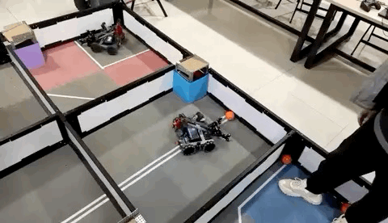

# 项目经历

## VEX 机器人比赛

> 该项目是作者在大一大二期间参加的 [VEX Robotics](https://www.vexrobotics.com/?srsltid=AfmBOoqnDK8kK1M_Eb3zuozB3iKQISBoxqxWXzLSMkEOXB5qTeB8bGiW)

如GIF动图所示，在仿造小车机械构造之后，进行功能的开发以及调试来适应机型以及场地要求，任务要求。
主要实现功能：

- 颜色识别与目标定位，通过 VEX Vision Sensor 对目标颜色进行识别，并配合电机抓取功能完成抓举任务

- 自动循迹与路径规划，结合 PID 控制算法实现平滑转弯与精准对位

- 远程与自主双模式切换，通过控制器按钮一键切换，便于场地测试与比赛任务调试

## RISC-V 二段流水CPU FPGA实现 （Xilinx Basys 3 Artix-7）

> 该项目是作者就读本科爱尔兰 University of Limerick 的毕业设计  

项目海报：

更多代码内容查看[Github仓库](https://github.com/SUN-Jingyu/FYP_sharing)

